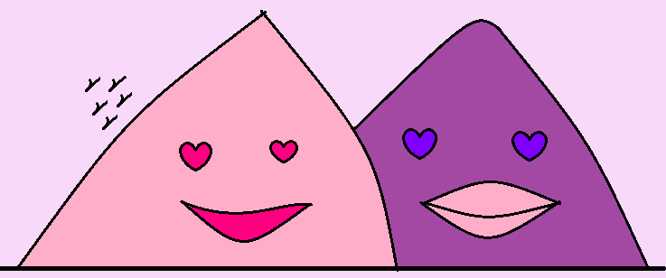

# cv
<html>
<head>
<title>I'M LALITHA</title>
<link rel="icon" href="favicon.ico">
<link rel="stylesheet" href="css2.css">
</head> 
<body>

<h1>I'm Lalli</h1>
<h4 class="small">MGRian BTECH</h4>

<a href="lali1.html">About </a>

<a href="message.html">Contact </a>

</body>
</html>
